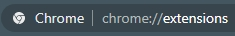
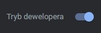
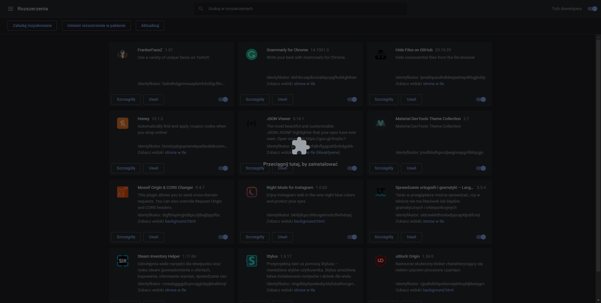

    Żeby zainstalować rozszerzenie wejdz pod adres: chrome://extensions/
     
     
    
     
     
    Po prawej stronie u góry strony przełącz przycisk:
     
     
    
     
     
    Przeciągnij ten folder do okna Google Chrome
     
     
    

